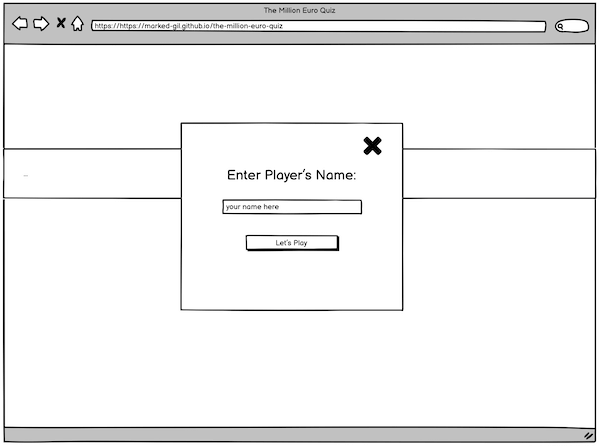
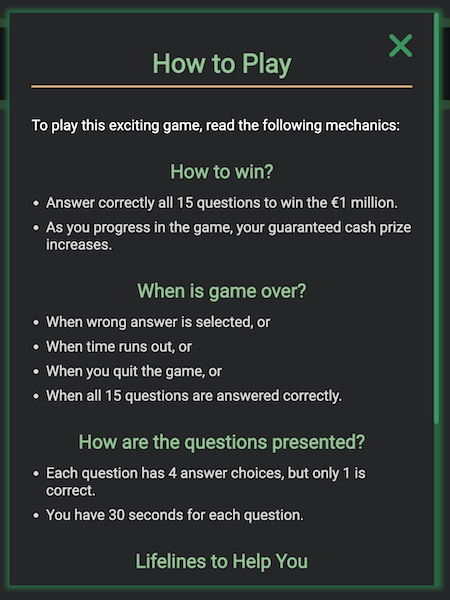
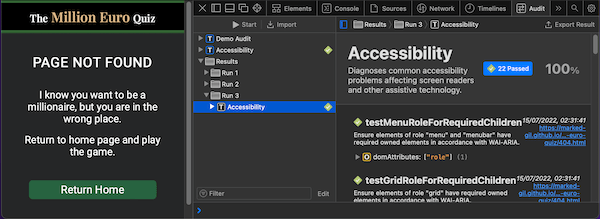

# The Million Euro Quiz


The **Million Euro Quiz** is a time-pressured online quiz game that tests the general knowledge of its player by asking 15 multiple-choice questions with varying difficulty levels, from easy to hardest, and simulates a game show that earns an increasing cash prize at every level, and with the top prize of € 1 million. Each question is provided with 4 randomly arranged answer choices among which only one is correct. Also, it contains a special feature, such as the lifelines, which are help tools for the player. This quiz is inspired by the game show 'Who Wants to be A Millionaire'. [View the live website](https://marked-gil.github.io/the-million-euro-quiz/).

## TABLE OF CONTENTS
* [User Experience Design (UXD)](#uxd-user-experience-design)
    * [Strategy](#strategy)
        * [Main Goal](#main-goal)
        * [Target Audience](#target-audience)
        * [User Stories](#user-stories)
    * [Scope](#scope)
        * [Planned Features](#planned-features)
        * [Design Choices](#design-choices)
    * [Structure](#structure)
        * [Interaction Design (IXD)](#interaction-design-ixd)
        * [Information Design/Architecture](#information-designarchitecture)
    * [Skeleton](#skeleton)
        * [Wireframes](#wireframes)
    * [Surface](#surface)
* [Features](#features)
    * [Home Page](#home-page)
    * [Game Page](#game-page)
    * [404 Page](#404-page)
    * [Features for the Future](#features-for-the-future)
* [Fixed Bugs](#fixed-bugs)
* [Bugs Left to Fix](#bugs-left-to-fix)
* [Testing](#testing)
    * [Responsiveness](#responsiveness)
    * [Accessiblity](#accessibility)
    * [Links/Buttons Functionality Testing](#linksbuttons-functionality-testing)
    * [Validator Testing](#validator-testing)
    * [Lighthouse Testing](#lighthouse-testing)
* [Deployment](#deployment)
    * [Version Control](#version-control)
    * [Github Pages Deployment](#github-pages-deployment)
    * [Cloning from Github](#cloning-from-github)
    * [Running Project Locally](#running-project-locally)
* [Technologies](#technologies)
* [Credits](#credits)
* [Acknowledgment](#acknowledgment)

---
## UXD (User Experience Design)
___
### **STRATEGY**
#### **Main Goal:**
* This site aims to provide an online quiz game to users, young and old, who want to play and enjoy a challenging game that tests their general knowledge. This is endeavored to be achieved by employing special features, which include a timer, lifelines, randomness of questions, progressive level of difficulty, and 'cash-prize winning' simulation. Also, this site aims to be keyboard command accessible so any person who wishes to use their keyboard in playing the game can do so.

#### **Target Audience**
* People, of any age group, who want to test their general knowledge.
* People who are interested in online games, including quizzes.
* People who enjoy a challenging game.
* People who love watching 'Who Wants To Be A Millionaire' game show, and would want to try a simulated game which has some resemblance to the famous show.

#### **User Stories:**
* As a user, I want to play a quiz game online to test my general knowledge.
* As a user, I want to feel a sense of challenge and excitement when playing the game, so it will not be just another ordinary quiz game.
* As a user, I want to play a simulation of a game that earns a cash prize so it will be more exciting.
* As a user, I want to re-play the game multiple times as I want and expect to be asked random questions each time so it will feel like new every time.
* As a user, I want to experience an increase in difficulty level as the game progresses to bring more challenge into it.
* As a user, I want to utilize strategic options to help me when a question is difficult, so the game will also have a strategic nature.
* As a user, I want to get immediate feedback on whether my answer is right or wrong so I will learn along the way.
* As a user, I want to have the feel of a personalized game so it would help preserve my interest in the game.
* As a user, I want to be able to quit the current game or return to home page so I would have the options to either play a new game or to enter a new name without needing to leave the site.
* As a user, I want to be able to read the mechanics of the game before starting, and even while playing the game so I can be guided well.
* As a user, I want the game to have an intuitive user interface so I can just play it straight away even without reading the mechanics of the game.
* As a user, I want to be able to play the quiz using the keyboard if I desire or need so, such as in times when my mouse is not working or when I have difficulty using a mouse due to whatever physical limitations.

[<u>Back to Table of Contents</u>](#table-of-contents)

### **SCOPE**
#### Planned Features:
This online quiz game has the following planned features based on the User Stories:
* User Story:
    > As a user, I want to play a quiz game online to test my general knowledge.
    *  IMPLEMENTATION: 
        * Provide 15 general knowledge quiz questions per game.

* User Story:
    > As a user, I want to feel a sense of challenge and excitement when playing the game, so it will not be just another ordinary quiz game.
    * IMPLEMENTATION:
        * A timer will be set for each question, and the player must select their answer before the timer ends, otherwise game will be over and player loses.
        * The questions will be categorized according to difficulty level, and questions will increase in difficulty as the game progresses.

* User Story: 
    > As a user, I want to play a simulation of a game that earns a cash prize so it will be more exciting.
    * IMPLEMENTATION:
        * A box will be displayed where cash prizes to be earned as level increases will be displayed and highlighted.
        * The current prize earned by the player will be displayed in realtime.

* User Story:
    > As a user, I want to re-play the game multiple times as I want and expect to be asked random questions each time so it will feel like new every time.
    * IMPLEMENTATION:
        * The game can be re-played multiple times by the player, and 'Play Again' button will be available when game is over or won.
        * Questions will be randomly selected and the order of their answer choices will be randomly displayed every time the game is played and re-played.

* User Story:
    > As a user, I want to experience an increase in difficulty level as the game progresses to bring more challenge into it.
    * IMPLEMENTATION:
        * There are 4 levels of difficulty of the questions to be presented: "**easy**" (for questions 1-5), "**moderate**" (for questions 6-10), "**hard**" (for questions 11-14), and **"hardest"** (for the last question).

* User Story: 
    > As a user, I want to utilize strategic options to help me when a question is difficult, so the game will also have a strategic nature.
    * IMPLEMENTATION:
        * Lifelines, which are help tools that increase the chances for the player to select the correct answer will be available. These lifelines are: (1) to remove 1 wrong answer, (2) to remove 2 wrong answers, and (3) to add more time to the timer.
        * One or more lifelines can be used in a question, but each lifeline can only be used once in the course of the game.

* User Story:
    > * As a user, I want to get immediate feedback on whether my answer is right or wrong so I will learn along the way.
    * IMPLEMENTATION:
        * After every answered question, a '✓' (check mark) will be shown on the selected answer when it is correct, and an 'x' (x mark) when it is wrong.

* User Story:
    > As a user, I want to have the feel of a personalized game so it would help preserve my interest in the game.
    * IMPLEMENTATION:
        * The game will require the player to enter their name before starting the game, and the player's name will be displayed while the game is on. Also, the player will be addressed by the their name when they lose or win the game.

* User Story:
    > As a user, I want to be able to quit the current game or return to home page so I would have the options to either play a new game or to enter a new name without needing to leave the site.
    * IMPLEMENTATION:
        * On the game page, the nav bar will contain the 'Home' button and 'Quit' button. When the 'Home' button is clicked, it will automatically redirect the user to the home page where the player can enter a new name and re-load the game. If the 'Quit' button is clicked, it will automatically stop the current game and show a popup box with options to play again or to return to home page.

* User Story: 
    > As a user, I want to be able to read the mechanics of the game before starting, and even while playing the game so I can be guided well.
    * IMPLEMENTATION:
        * A 'How to Play' lightbox (modal) will be available to the player when they want to read the mechanics of the game. This can be accessed before the start of the game in the home page, and even when the game is on in the game page . A button will be provided for this.

* User Story: 
    > As a user, I want the game to have an intuitive user interface so I can just play it straight away even without reading the mechanics of the game.
    * IMPLEMENTATION:
        * The design of the game display will be minimalist and intuitive.
        * The home page will only show the logo, and 2 buttons ('Play' and 'How To Play' buttons).
        * The game page will have a logo, nav bar with 3 nav links/buttons ('Home', 'How To Play' and 'Quit'), the player's name and money earned, cash prizes box, lifelines, and the main game area where the question and multiple answer choices will be displayed.
        * The popup boxes will be minimal in text content, and will only contain 1 or 2 buttons/links.

* User Story:
    > * As a user, I want to be able to play the quiz using the keyboard if I desire or need so, such as in times when my mouse is not working or when I have difficulty using a mouse due to whatever physical limitations.    
    * IMPLEMENTATION:
        * The site will be created with consideration to keyboard accessibility.
        * All the interactive buttons and links must be accessible by a keyboard command.
        * The game will work in similar way using mouse, keyboard, or touch-screen.     

#### **Design Choices:**
This online game site is created with a minimalist, uncluttered design theme that seeks to retain the user's focus on the game. The play of mainly **shades of green** is chosen due to its calming and stress-relieving effects to the user who, I believe, will play the game as a diversion from the hassles of life. Also, some other colors to serve as accents are used.

* **Color Scheme**:     
    The following are the colors used:
    * #ffffff (White)    
    * #dad9d8 (Light silver)
    * #000000 (Black)
    * #252627 (Raisin black)
    * #264137 (Outer-space green)
    * #336633 (Mughal green)
    * #266340 (Deep-moss green)
    * #3a9561 (Sea green)
    * #93C393 (Dark-sea green)
    * #deb887 (Burlywood)
    * #b6a733 (Brass)
    * #e1cd33 (Sandstorm - yellow)
    * #f0e699 (Khaki - yellow)      
    ([See **SURFACE** section for more details](#surface))  

* **Typography**:      
    This website uses fonts from [Google Fonts](https://fonts.google.com/). The following are the utilized fonts:
    * **Roboto** — the default font for the site
    * **Playfair Display** — used on the main logo
    * **Roboto Slab** — used on the cash prizes (inside money box)  
    ([See **'SURFACE'** section for more details](#surface))    

* **Layout**    
    * **The Logo** - The layout of the logo in the home page is deliberately designed to have the words 'The' and 'Quiz' to stay above and below, respectively, to the main title 'Million Euro'. This is different from how the logo in the game page and 404 page are laid out. This is because I feel it looks better on the home page, and the other pages are adequately served with the simpler linear arrangement of the logo.  

    * **The Home Page & 404 Page** - These pages are kept simple and minimalistic (containing only the logo and button/s) to decrease distraction, and to give a touch of straightforwardness to the site, which I believe most users may prefer.   

    * **The Game Page** - To maintain the intended simplicity of the site design, the game page is mainly divided into to 2 sections: the Nav Bar (for logo and nav menu), and the Game Area. As this is a game website, the game area contains the interactive functions (answer buttons and lifelines) and displays (player name, cash earned, game levels with cash prizes, question, and the answer choices) relating the to game session.   

    * **The Lightboxes (popups)** - The modals or lighboxes are all designed consistently with changes only in their content.

    * **Change in Layout Between Large and Small Screens**   
        All the elements of the site that can be seen on large-screen devices are also included in the layout for the small-screen devices. However, due to the restriction posed by the smaller screens, the entire box container of the cash prizes has to be converted into a small rectangular box that can display a single value at a time. And it is located at the top of the lifelines. 

[<u>Back to Table of Contents</u>](#table-of-contents)

### **STRUCTURE**

#### **Interaction Design (IXD)**
* Consistent:   
    * The color scheme is consistent by using shades of green dominantly, and some yellow colors, in the entire site. 
    * The fonts used are consistent across all pages of the site.   
    * The look and feel of the lightboxes (modals) are similar.    
    * There is consistency in the navigation system of the site and the game. Nav links are placed at the top of the game page and 404 page. Also, other bottoms - such as the 'home', 'play', and 'play again' - are always located at the bottom after some text content where a user would expect them to be seen after reading a short textual information. 
    * The logo appears on each page of the site.    
    * Feedbacks are available for each interaction a user does in the site. Examples include:   
        * When a mouse hovers on a link and button, a style change on the hovered link/button would appear, thus making the user aware that it is a clickable button/link.  
        * Also, when clicking certain buttons, a lightbox (popup box) will show up to provide more information or as a feedback to the action taken by the user.  

* Predictable:
    * The layout of each site page is simple and very intuitive, that the user would easily realize where they are on the home page. 
    * The buttons are placed strategically where users expect them to be, such as at the end of a short text of information, or at the top right beside the heading for the 'close' button in the 'How to Play' and 'Enter Name' lightboxes.      

* Learnable:
    * The navigation of the website is extremely learnable and very intuitive due to its simple styling and minimalistic design.  
    * The game itself is easy to learn and users may dive into it and discover how it works effortlessly.        

* Visible:
    * The site is made simple and minimalistic so the user can easily locate the buttons they want to click or the information they need in the site.   
    * The fonts are of sufficient size to ensure that the components of the site can be easily seen or read.    
    * The texts for these questions and answer options can be easily read through the use of a reader-friendly font.     

* Provides clear and intuitive feedback:
    * The buttons and links can be hovered and will show style changes in them to tell the user that they are functional or clickable.  
    * The buttons and links can be clicked and may provide a lightbox (popup box) as a feedback depending on the button.

#### **Information Design/Architecture**    
* The content of the website is made certain to be useful and necessary for its function as an online quiz game website. 
* Its contents are grouped adequately for consistency, preditability, and ease of use for the user. Examples include:   
    * The nav links are grouped together at the top of the game page.
    * The question, multiple answer choices, timer, player name and prize earned are grouped in the game area.  
    * Feedbacks, such as the lightboxes (popups), to user's interaction with the site are designed consistently and simply.

[<u>Back to Table of Contents</u>](#table-of-contents)

### **SKELETON**

The following are the wireframes used to build this website. These wireframes were created using [Balsamiq](https://balsamiq.com/).
#### **Wireframes**     
* **Home Page**     

    * Mobile Screen  
    
    
       

    * Large Screen      
    
    

* **Game Page**     
    * Mobile Screen     
    
    
    
    

    * Large Screen   
    
    
    
    
    

* **404 Page**      
    * Mobile Screen     
    

    * Large Screen   
    

[<u>Back to Table of Contents</u>](#table-of-contents)

### Surface     
This site was created using several shades of colors that were mixed and matched to produce a harmonious design. Following are the colors and typography utilized:  

(To see the finished product, proceed to [**FEATURES**](#features).)
* **Colors & Contrast**      

    

* **Typography (Font Families)**   
    The following fonts from [Google Fonts](https://fonts.google.com/) are used in this website:    
    
    
        

[<u>Back to Table of Contents</u>](#table-of-contents)

___
## FEATURES
___

### **Home Page**
The home page is simple and only shows the website logo and 2 buttons ('Play' & 'How to Play').    

    

**'Enter Name' Lightbox**    
When the 'Play' button is clicked, this lightbox will pop up where the user can enter a name before being admitted into the game page.  
* Inside the lightbox, the user will be required to enter a name before they can proceed to the game page. Clicking the "Let's Play" button without entering at least 1 character will flash a message to the user: 'You need to enter your name'.  
* Also, the entered name can only have a maximum of 12 characters and allowing only letters, numbers, and space in between - breaching these will result to a flash message being displayed and the user prevented from proceeding to the game page.   

    
    
**'How To Play' Lightbox**    
When the 'How to Play' button is clicked, this lightbox will pop up. It contains the instruction for, or mechanics of, the quiz game.   
* It includes an 'x' icon that can close the lightbox. This is located at the top right of the lightbox.     

    

### **Game Page**       
The Game Page contains the **Nav Bar** (which has the logo and nav menu) - and the **Game Area**.  
* Large Screen    
     

* Small Screen (Mobile)   
    

**Navigation Bar** (Logo & Nav Menu)  
The navigation bar contains the website logo, and the nav menu.     
* **Logo** - displays 'The Million Euro Quiz' with a black background, and a green top/bottom border.   

* **Nav Menu** — includes the following links: **'Home'**, **'How To Play'**, **'Quit'**    
    * **'Home'** link — redirects to the home page.
    * **'How To Play'** link — brings out the 'How To Play' lightbox.
    * **'Quit'** link — immediately quits the game by stopping the timer, and displaying the 'Quit' lightbox.       

**Game Area**   
The game area contains the following:   

* **Countdown To Start**    
A 3-second countdown shows up when opening the Game Page, and before the 1st question is revealed.  

    

* **Player**    
The player's name is displayed at the top left of the game area. This is the name of the player as provided by the user before starting the game.

* **Cash**  
This is the current cash earned by the player displayed at the top right of the game area.

* **Cash Prizes (level) Box**   
This container houses the cash value of each level of the game. The game is comprised of 15 levels (15 questions), hence 15 specific incrementing amounts. As the player answers a question correctly, the player goes up a level higher and its corresponding cash is the amount they can possibly win.    
    
    The current cash value of the game level will be highlighted, and as the player answers it correctly, a star icon will be displayed beside the amount.

* **Lifelines**    
The LIFELINES are the tools that can help the player in answering difficult questions and giving them a higher chance to choose the correct answer. The game provides 3 lifelines as represented by 3 icons: (1) removes 1 wrong answer, (2) removes 2 wrong answers, and (3) adds an additional 30 seconds to the timer.     

    The player can choose to use one or more lifelines in a question, but each lifeline can only be used once in a game session.      

    

* **Question Container**     
The question container consists of the question number, the main question, and the timer.    

       

    * **Question**  
    There are a maximum of 15 questions that will be thrown to the player in a game session. These questions are randomly selected and increase in difficulty as the game progresses. The first 5 questions are easy, the next 5 questions are moderate, the following 4 questions are hard, and the 15th question is of the hardest level.

    * **Timer**     
    Each question has an allotted time of 30 seconds. The player has to choose and click their answer before this time runs out. If the timer finishes before the player successfully chooses an answer, the game automatically becomes over and the player gets whatever current prize they have already earned.

* **Answer Buttons**    
As this game is a multiple-choice quiz, the player is presented with four (4) answer choices/options for each question. Only one of the four (4) choices is correct.    

         

    Each answer choice is a button, which the player can click/tap to select. When an answer is selected, all the buttons in the page including the other answer choices will be inactive momentarily for 1 second. Also, after the short pause, it will be revealed whether your answer is correct (by a check mark) or wrong (by an 'x' mark).    

    If the selected answer is correct, the game will proceed to the next question and timer will reset. If the player's answer is wrong, the game will be over and the player gets whatever cash prize they have already earned (which is equivalent to their last level in the game).

**Lightboxes (Popups)**       

* **'Game Over' Lightbox**  
The 'Game Over' lightbox shows up when time has run out or when player chooses the wrong answer. Inside this popup window, the player has the option to play again or to go to home page. While this lightbox is on display, all other buttons/links at the background are inactive.    

      

* **'Game Won' Lightbox**   
The 'Game Won' lightbox pops up when the player has successfully answered all 15 questions on the session. It congratulates the player for winning € 1 million and provides the option to play again or go to homepage.    

    

* **'Quit' Lightbox**   
    In the 'Quit' lightbox, the user can choose to go to home page or play the game again, which will re-start the game session. If the player quits in the middle of the game, the player loses the game and goes home with no money.     

    

* **'How To Play' Lightbox**   
    This 'How To Play' link in the nav bar can be clicked while the game is in progress, however the timer will still continue to run even when the lightbox is showing, and game will be over when time runs out. This is intended to protect the integrity of the game session. (More description of this is found in the ['Home Page'](#home-page) section above.)

### **404 Page**  
The 404 Page simply informs the user that there is nothing to be found in that page, and suggests to the user to go back to the home page to play the quiz game. A 'Return Home' button is available for the user to click.     


[<u>Back to Table of Contents</u>](#table-of-contents)

### **Features for the Future**
* In the future, I want to revisit this site and add more available questions, perhaps using APIs or database.  

___
## FIXED BUGS   
___
* **ISSUE:**   
    This site has 3 pages (html files) and using only 1 javascript file. When I ran the 'game page', it works perfectly fine without errors. But, when I went to the 'home page', an error showed up in the console: `Uncaught TypeError: Cannot set properties of null (setting ‘innerText’) at displayQuestion`.
    * **INTENDED OUTCOME**:   
    I expect no error to show up even in the console when I go to any pages of the site.

    * **SOLUTION**:     
    As advised in [stackoverflow](https://stackoverflow.com/questions/44182660/add-eventlistener-to-only-one-html-page), I added an ID name to the `<body>` element and used an `if statement` so the codes intended for the gamepage would only run if the current location the user is at is the 'game page'.

* **ISSUE:**    
    On a mobile device, when I tap on a hoverable button, the hover style sticks on the screen.
    * **INTENDED OUTCOME**:     
    I expect that in mobile devices, the hover style on buttons will not show up or stick to the screen.
    
    * **SOLUTION**:
    As advised by [CSS-TRICKS](https://css-tricks.com/solving-sticky-hover-states-with-media-hover-hover/) website, I used the media query `@media (hover: hover)` so the hover styling will only apply to devices that have the capability for hover, which does not usually include touchscreen devices.

___
## BUGS LEFT TO FIX   
___
The only bug I found that I could not fix at the moment is that the code I used to customize the color of the scrollbar and scrollbar thumb of the **'How To Play' lightbox** is not working IOS. However, I found in this [link](https://developer.apple.com/forums/thread/670065) that custom scrollbars are no longer supported in IOS 14. My iPhone is actually on IOS 15.5, but I also noted from [Can I Use](https://caniuse.com/?search=webkit%20scrollbar) website that ```"From Safari 13, only display: none works with the pseudo-element ::-webkit-scrollbar. Other styles have no effect."``` Although a bit disappointing, the default scrollbar in IOS 15 actually still complements the design & color of the lightbox. Its scrollbar is thin and hides automatically when not used. Thus, I am happy to leave it as it is.     

[<u>Back to Table of Contents</u>](#table-of-contents)
___
## TESTING
___
### Responsiveness      
This site is fully responsive and works well from a minimum screen size of 280px.   
* The web developer tools of the main web browsers (Chrome, Firefox,, Microsoft Edge, and Safari) were used to check for responsiveness.    
* The online tool [Mobile-Friendly Test](https://search.google.com/test/mobile-friendly) has validated the responsiveness of the site.  

     
     
       

### Accessibility
* Safari Accessibility Audit Results    
    * Home Page     
        
    * Game Page     
        
    * 404 Page      
          

* Color Contrast Accessibility Validator Results
    * Home Page      
           

    * Game Page  
       

    * 404 Page   
         

* The [WAVE - Web Accessibility Evaluation Tool](https://wave.webaim.org/) browser extension was utilized throughout the development of this website to ensure the accessibility of the website.

* Manual Testing for Keyboard Accessibility     
    | Keystrokes | Effects | Achieved |
    | ---------- | ------- |--------- |
    | 'Tab' key | Navigates forward to all the interactive links/buttons | Yes |
    | 'Shift' + 'Tab' keys | Navigates backward to all the interactive links/buttons | Yes |
    | 'Enter' or 'Spacebar' | Activates the links and buttons | Yes |
    | 'Escape' key | closes 'Enter Name' & 'How to Play' lightboxes | Yes |
    | 'Up' & 'Down' arrow keys | Scrolls the 'How to Play' lightbox up and down | Yes |
    |  | Default focus styling present on the interactive elements focused on | Yes |
    |  | Keyboard accessibility are disabled and enabled when necessary on specific interactions on the page | Yes |
    |  | The site can be fully accessed with keyboard alone. | Yes |

### **Links/Buttons Functionality Testing**
* All the links and buttons of the site were manually tested on different browsers (Chrome, Firefox, Microsoft Edge, and Safari) and are confirmed to be working as shown in the table below:    

        

### **Validator Testing**   
* [**JSHint**](https://jshint.com/) - NO ERRORS were found in the Javascript of the site. JSHint was configured to ES6. 

    

* [**W3C Markup Validator**](https://validator.w3.org/) - NO ERRORS were found in the HTML of the site.   
Home Page   
      
Game Page   
   
404 Page    
     

* [**W3C CSS Validator**](https://jigsaw.w3.org/css-validator/) - NO ERRORS were found in the CSS of the site.      
  
    
### **Lighthouse Testing**

**On Desktop**    
* Home Page    
         

* Game Page   
         

* 404 Page    
       

**On Mobile**    
* Home Page    
         

* Game Page     
         

* 404 Page      
       


[<u>Back to Table of Contents</u>](#table-of-contents)

___
## DEPLOYMENT
___
### **Version Control**
In developing this site, **git** was a crucial tool used to track changes made in the repository. The following **git** commands were mainly used:      
* `git status` — to show the status of the repository by displaying the files that have been staged and are ready for commit, those that are not, and those that are untracked.
* `git add <file name>` — to add file or changes in the file to the staging area before they can be commited
* `git commit -m "message"` — to add/record file or changes to the local repository
* `git push` — to upload the local repository to the remote repository, such as GitHub

### **Github Pages Deployment**
This website is published on [GitHub Pages](https://pages.github.com/). The following were the steps in deploying the site:
1. Inside the Github repository of 'the-million-euro-asia', I clicked 'Settings' on the menu just below the respository name.
2. Then, among the options on the left sidebar, I clicked on 'Pages'.
3. On the right side of the sidebar, I looked for 'Source', and under that was a dropdown menu for 'Branch'.
4. I clicked on the dropdown menu for Branch, and selected 'main'.
5. Then, I clicked 'Save' button. The deployed website was'live' after few minutes.     
View the live website here: https://marked-gil.github.io/the-million-euro-quiz/

### **Cloning from Github**
To clone the repository for this site, do the following steps:  
1. Go to this url: https://github.com/marked-gil/the-million-euro-quiz
2. Inside the repository, look for the button labeled as '**Code**', which is along the rows with other buttons such as 'Got to file' and 'Add file'.
3. Click on the '**Code**' button, and a small popup box will show up with a top heading of '**Clone**'.
4. In the popup box, click on the 'HTTPS' link and copy the url just below it.
5. Then, go to your computer's terminal and type `git clone <url of the repository>`.
6. A copy of the repository is now saved in your computer.

### **Running Project Locally**
1. Go to the repository: https://github.com/marked-gil/the-million-euro-quiz
2. Inside the repository, look for the button labeled as '**Code**' and click it.
3. Inside the modal (popup box) that comes out, click **Download Zip**.
4. Once the zip file is downloaded, unzip it if necessary, and open the index.html to run the project locally.

[<u>Back to Table of Contents</u>](#table-of-contents)
___
## TECHNOLOGIES
___
The following technologies are used in this website:    
* Programming Languages: 
    * **Javascript**
    * **HTML** - Hypertext Markup Language
    * **CSS** - Casscading Style Sheets     
* Web browsers (Google Chrome, Firefox, Safari, Microsoft Edge)
* [**Gitpod**](https://gitpod.io/) — the cloud-based IDE (Integrated Developer Environment) used to build this site.
* **Git** — as a version control system, was used to monitor and record changes made when building the site. This allowed for the restoration of an earlier version of the code when it was necessary.
* [**GitHub**](https://github.com/) — stores the source code repository for this website.
* [**GitHub Pages**](https://pages.github.com/) — hosts the live website.
* [**Google Fonts**](https://fonts.google.com/) — provides the fonts used in this website. (see [Design Choices](#design-choices))
* [**Font Awesome**](https://fontawesome.com/) — provides the icons used for the Lifelines.
* [**Favicon.io**](https://favicon.io/) — used for the icon displayed beside the site title seen in the browser tab.
* [**Balsalmiq**](https://balsamiq.com/) - used in creating the wireframes of this project's design concept.
* [**TinyPNG**](https://tinypng.com/) - used to compress size of images
* [**Diffchecker**](https://www.diffchecker.com/diff) - used in comparing texts
* For testing and validating:
    * [JSHint](https://jshint.com/)
    * [W3C Markup Validator](https://validator.w3.org/)
    * [W3C CSS Validator](https://jigsaw.w3.org/css-validator/)
    * [WAVE - Web Accessibility Evaluation Tool](https://wave.webaim.org/)
    * [Contrast Grid](https://contrast-grid.eightshapes.com/)
    * [Mobile-Friendly Test](https://search.google.com/test/mobile-friendly)
    * [Color Contrast Accessibility Validator](https://color.a11y.com/)
    * Lighthouse Developer Tool
    * Safari Accessibility Audit

[<u>Back to Table of Contents</u>](#table-of-contents)
___
## CREDITS
___
### **Content**
* **Questions**     
    The questions in this quiz game are taken from the following sources:
    * [Trivia Quiz Night](https://triviaquiznight.com/easy-general-knowledge-questions-and-answers/)
    * [Mentimeter](https://www.mentimeter.com/blog/audience-energizers/55-free-trivia-and-fun-quiz-question-templates)
    * [Brightful.me](https://www.brightful.me/blog/general-trivia-questions/)
    * [Express.co.uk](https://www.express.co.uk/life-style/life/1278265/100-general-knowledge-quiz-questions-and-answers)
    * [RadioTimes](https://www.radiotimes.com/quizzes/pub-quiz-general-knowledge/)
    * [Kidadl](https://kidadl.com/kids/trivia/hardest-trivia-questions-and-answers-to-test-the-biggest-brainiacs)       

* **Other resources** (See [Technologies](#technologies) section) 
    * [Google Fonts](https://fonts.google.com/)
    * [Fontawesome](https://fontawesome.com/)
    * [Favicon.io](https://favicon.io/)

### **Media**
* Images
    * <a href="https://www.flaticon.com/free-icons/star" title="star icons">Star icons created by Ghozi Muhtarom - Flaticon</a>
    * <a href="https://www.flaticon.com/free-icons/tick" title="tick icons">Tick icons created by Freepik - Flaticon</a>
    * <a href="https://www.flaticon.com/free-icons/wrong" title="wrong icons">Wrong icons created by Mihimihi - Flaticon</a>

### **References**
* Main Go-to Sites for CSS, HTML & Javascript:
    * [MDN](https://developer.mozilla.org/en-US/)
    * [W3schools](https://www.w3schools.com/)
    * [Code Institute lessons](https://codeinstitute.net/ie/)

* [Stackoverflow](https://stackoverflow.com/), especially the following links:
    * [Using 1 JS file on multiple HTML files](https://stackoverflow.com/questions/44182660/add-eventlistener-to-only-one-html-page)
    * [Regex for alphamumeric characters](https://stackoverflow.com/questions/388996/regex-for-javascript-to-allow-only-alphanumeric)   
    * [Regex to allow space between words](https://stackoverflow.com/questions/15472764/regular-expression-to-allow-spaces-between-words)

* [CSS-TRICKS](https://css-tricks.com/solving-sticky-hover-states-with-media-hover-hover/) - Solves the issue with sticky hover state on mobile devices
* [Stefan Judis](https://www.stefanjudis.com/snippets/how-to-color-the-browser-scrollbar-across-browsers/) - Shows how to color the scrollbar across main browsers

[<u>Back to Table of Contents</u>](#table-of-contents)
___
## ACKNOWLEDGMENT
___
* Ms. Daisy McGirr, my Code Institute mentor, for the professional and valuable guidance to complete this project.  
* Kyle, my supportive wife, for never failing to be the wind beneath my wings.