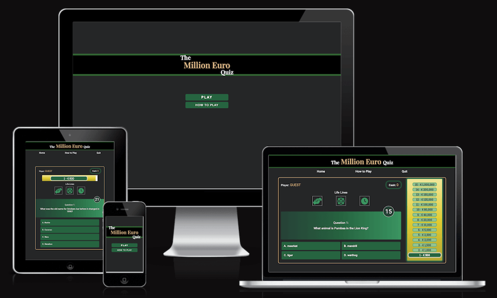
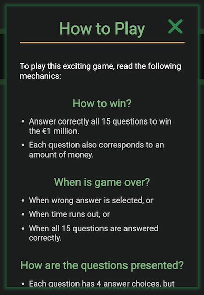
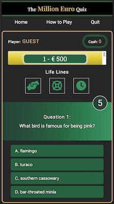
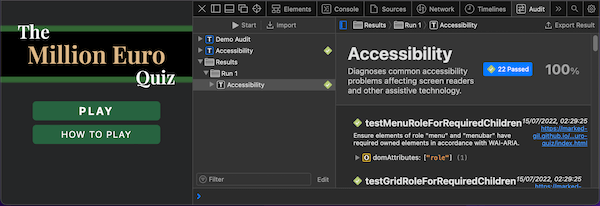

# The Million Euro Quiz

The **Million Euro Quiz** is a time-pressured online quiz game that tests the general knowledge of its player by asking 15 multiple-choice questions with varying difficulty levels, from easy to hardest, and simulates a game show that earns a cash prize. Each question is provided with 4 randomly arranged answer choices among which only one is correct. Also, it contains a special feature, such as the life lines, which are help tools for the player. [View the live website](https://marked-gil.github.io/the-million-euro-quiz/).

## TABLE OF CONTENTS
* [User Experience Design (UXD)](#uxd-user-experience-design)
    * [Strategy](#strategy)
        * [Goal](#goal)
        * [User Stories](#user-stories)
    * [Scope](#scope)
        * [Planned Features](#planned-features)
        * [Design Choices](#design-choices)
    * [Structure](#structure)
        * [Interaction Design (IXD)](#interaction-design-ixd)
        * [Information Design/Architecture](#information-designarchitecture)
    * [Skeleton](#skeleton)
        * [Wireframes](#wireframes)
    * [Surface](#surface)
* [Features](#features)
    * [Home Page](#home-page)
    * [Game Page](#game-page)
    * [404 Page](#404-page)
    * [Features for the Future](#features-for-the-future)
* [Fixed Bugs](#fixed-bugs)
* [Bugs Left to Fix](#bugs-left-to-fix)
* [Testing](#testing)
    * [Responsiveness](#responsiveness)
    * [Accessiblity](#accessibility)
    * [Links/Buttons Functionality Testing](#linksbuttons-functionality-testing)
    * [Validator Testing](#validator-testing)
    * [Lighthouse Testing](#lighthouse-testing)
* [Deployment](#deployment)
    * [Version Control](#version-control)
    * [Github Pages Deployment](#github-pages-deployment)
    * [Cloning from Github](#cloning-from-github)
* [Technologies](#technologies)
* [Credits](#credits)
* [Acknowledgment](#acknowledgment)

---
## UXD (User Experience Design)
___
### **STRATEGY**
#### **Goal:**
* This site aims to provide an online quiz game to users, young and old, who want to play and enjoy a challenging game that tests their general knowledge. This is endeavored to be achieved by employing special features, which include a timer, life lines, randomness of questions, progressive level of difficulty, and 'cash-prize winning' simulation.

#### **User Stories:**
* As a user, I want to play a quiz game online to test my general knowledge.
* As a user, I want to feel a sense of challenge and excitement when playing the game, so it will not be just another ordinary quiz game.
* As a user, I want to play a simulation of a game that earns a cash prize so it will be more exciting.
* As a user, I want to re-play the game multiple times as I want and expect to be asked random questions each time so it will feel like new every time.
* As a user, I want to experience an increase in difficulty level as the game progresses to bring more challenge into it.
* As a user, I want to utilize strategic options to help me when a question is difficult, so the game will also have a strategic nature.
* As a user, I want to get immediate feedback on whether my answer is right or wrong so I will learn along the way.
* As a user, I want to have the feel of a personalized game so it would help preserve my interest in the game.
* As a user, I want to be able to quit the current game or return to home page so I would have the options to either play a new game or to enter a new name without needing to leave the site.
* As a user, I want to be able to read the mechanics of the game before starting, and even while playing the game so I can be guided well.
* As a user, I want the game to have an intuitive user interface so I can just play it straight away even without reading the mechanics of the game.

### **SCOPE**
#### Planned Features:
This online quiz game has the following planned features based on the User Stories:
* User Story:
    > As a user, I want to play a quiz game online to test my general knowledge.
    *  IMPLEMENTATION: 
        * Provide 15 general knowledge quiz questions per game.

* User Story:
    > As a user, I want to feel a sense of challenge and excitement when playing the game, so it will not be just another ordinary quiz game.
    * IMPLEMENTATION:
        * A timer will be set for each question, and the player must select their answer before the timer ends, otherwise game will be over and player loses.
        * The questions will be categorized according to difficulty level, and questions will increase in difficulty as the game progresses.

* User Story: 
    > As a user, I want to play a simulation of a game that earns a cash prize so it will be more exciting.
    * IMPLEMENTATION:
        * A box will be displayed where money prizes to be earned per question will be displayed and highlighted.
        * The current prize earned by the player will be displayed in realtime.

* User Story:
    > As a user, I want to re-play the game multiple times as I want and expect to be asked random questions each time so it will feel like new every time.
    * IMPLEMENTATION:
        * The game can be re-played multiple times by player, and 'Play Again' button will be available when game is over or won.
        * Questions will be randomly selected, and the order of their answer choices will be randomly displayed, every time the game is played and re-played.

* User Story:
    > As a user, I want to experience an increase in difficulty level as the game progresses to bring more challenge into it.
    * IMPLEMENTATION:
        * There are 4 levels of difficulty for the questions to be presented: "**easy**" (for questions 1-5), "**moderate**" (for questions 6-10), "**hard**" (for questions 11-14), and **"hardest"** (for the last question).

* User Story: 
    > As a user, I want to utilize strategic options to help me when a question is difficult, so the game will also have a strategic nature.
    * IMPLEMENTATION:
        * Life lines, which are help tools that increase the chances for the player to select the correct answer will be created. These life lines are: (1) to remove 1 wrong answer, (2) to remove 2 wrong answers, and (3) to add more time to the timer.
        * One or more life lines can be used in a question, but each life line can only be used once in the course of the game.

* User Story:
    > * As a user, I want to get immediate feedback on whether my answer is right or wrong so I will learn along the way.
    * IMPLEMENTATION:
        * After every answered question, a '✓' (check mark) will be shown on the selected answer when it is correct, and an 'x' (x mark) when it is wrong.

* User Story:
    > As a user, I want to have the feel of a personalized game so it would help preserve my interest in the game.
    * IMPLEMENTATION:
        * The game will require the player to enter their name before starting the game, and the player's name will be displayed while the game is on. Also, the player will be addressed by the their name when they lose or win the game.

* User Story:
    > As a user, I want to be able to quit the current game or return to home page so I would have the options to either play a new game or to enter a new name without needing to leave the site.
    * IMPLEMENTATION:
        * On the game page, the nav bar will contain the 'Home' button and 'Quit' button. When the 'Home' button is clicked, it will automatically redirects the user to the home page, and if they want to play the game again, they will have to enter their name. If the 'Quit' button is clicked, it will automatically stop the current game and show a popup box with options to play again or to return to home page.

* User Story: 
    > As a user, I want to be able to read the mechanics of the game before starting, and even while playing the game so I can be guided well.
    * IMPLEMENTATION:
        * A 'How to Play' popup box will be available for the player when they want to read the mechanics of the game. This can be accessed before the start of the game, and even when the game is on. A button or link will be provided for this.

* User Story: 
    > As a user, I want the game to have an intuitive user interface so I can just play it straight away even without reading the mechanics of the game.
    * IMPLEMENTATION:
        * The design of the game display will be minimalist.
        * The home page will only show the logo, and 2 buttons ('Play' and 'How To Play' buttons).
        * The game page will have a logo, nav bar with 3 nav links ('Home', 'How To Play' and 'Quit'), the player's name and money earned, cash prize box, life lines, and the main game area where the question and multiple answer choices will be displayed.
        * The popup boxes will be minimal in text content, and will only contain 1 or 2 buttons/links.

#### **Design Choices:**
This online game site is created with a minimalist, uncluttered design theme that seeks to retain the user's focus on the game. The play of shades of green is chosen due to its calming and stress-relieving effects to the user who, I believe, will play the game as a diversion from the hassles of life.

* **Color Scheme**: 
    * Green
    <!-- more content -->
* **Typography**:   
This website uses fonts from [Google Fonts](https://fonts.google.com/). The following are the utilized fonts:
    * **Roboto** — the default font for the site
    * **Playfair Display** — for the main logo
    * **Roboto Slab** — for the cash prize amount (number)

### **STRUCTURE**

#### **Interaction Design (IXD)**
* Consistent:   
    * The color scheme is consistent by mainly using shades of green and some yellow-like color in the entire page. 
    * The fonts used are consistent across all pages of the site.   
    * The look and feel of the lightboxes (popup boxes) are similar.    
    * There is consistency in the navigation system of the site and the game. Nav links are placed at the top of the game page, and 404 page. Also, other bottoms - such as the home, play, and play again - are always located at the bottom of some text content where a user would expect them to be seen after reading a short textual information. 
    * The logo appears on each page of the site.    
    * Feedbacks are available for each interaction a user does in the site. Examples include:   
        * When a mouse hovers on a link and button, a style change on the hovered link/button would appear, thus making the user aware that it is a clickable button/link.  
        * When clicking on a button, it would momentarily change the style of the button to confirm that it was successfully clicked.   
        * Also, when clicking certain buttons, a lightbox (popup box), would show up to provide more information or as a feedback to the action taken by the user.  

* Predictable:
    * The layout of each page of the site is simple and very intuitive, that the user would easily realize where they are on the home page. 
    * The buttons are placed strategically where users expect them to be, such as at the end of a short text of information, or at the top right beside the heading for the 'close' button in the 'How to Play' lightbox.      

* Learnable:
    * The navigation of the website is extremely learnable and very intuitive due to its simple styling and minimalist design.  
    * The game itself is easy to learn and users may dive into it and discover how it works effortlessly.        

* Visible:
    * The site is made simple and minimalist so that the user can easily locate the buttons they want to click, or the information they need in the site.   
    * The fonts are of sufficient size to ensure that the components of the site can be easily seen or read.    
    * The texts for these questions and answer options can be easily read through the use of a reader-friendly font.     

* Provides clear and intuitive feedback:
    * The buttons and links can be hovered and will show style changes in them to tell the user that they are functional or clickable.  
    * The buttons and links can be clicked and will show a momentary style change, and may also provide a lightbox (popup box) as a feedback.

#### **Information Design/Architecture**
*

### **SKELETON**

The following are the wireframes used to build this website. These wireframes are created using [Balsamiq](https://balsamiq.com/).
#### **Wireframes**

* **Home Page**     

    * Mobile Screen  
    
    
       

    * Large Screen      
    
    

* **Game Page**     
    * Mobile Screen     
    
    
    
    

    * Large Screen   
    
    
    
    
    

* **404 Page**      
    * Mobile Screen     
    

    * Large Screen   
    

### Surface 
* Colors & Contrast      
    

* Typography (Font Families & Sizes)    

* Specific layout

___
## FEATURES
___

### **Home Page**
The home page is simple and only shows the website logo, and 2 buttons ('Play' & 'How to Play').

* **'Enter Player's Name' Lightbox**    
    When the 'Play' button is clicked, this lightbox will pop up where the user can enter a name before entering the game page.     
    * Inside the lightbox, the user will be required to enter a name before they can proceed to the game page. Clicking the "Let's Play" button without entering at least 1 character will flash a message to the user.   
    * Also, the entered name can only have a maximum of 12 characters - beyond this, a flash message will show up and the user is prevented from typing beyond 12 characters.   
    

* **'How To Play' Lightbox**    
    When the 'How to Play' button is clicked, this lightbox will pop up which contains the instruction for, or mechanics of, the quiz game.
    * Contains an 'x' icon to close the lightbox. This is located at the top right of the lightbox.     
    

### **Game Page**

* **Navigation Bar** (Logo & Nav Menu)  
    The navigation bar contains the website logo, and the nav menu.
    * **Logo**
    * **Nav Menu** — includes the following links: **'Home'**, **'How To Play'**, **'Quit'**
        * **'Home'** link — redirects to the home page.
        * **'How To Play'** link — brings out the 'How To Play' lightbox.
        * **'Quit'** link — immediately quits the game by stopping the timer, and displaying the 'Quit' lightbox.

* **Countdown To Start**    
    
* **Player**    
    The player's name is displayed at the top left of the game area. This is the name of the player as provided by the user before starting the game.

* **Cash**  
    This is the current cash earned by the player displayed at the top right of the game area.

* **Cash Prizes Box**   
    This container houses the cash value of each level of the game. The game is comprised of 15 levels (15 questions), hence 15 specific cash amounts. As the player answers a question correctly, the player goes up a level higher and its corresponding cash is the amount they can possibly win.    

    The current cash value of the game level will be highlighted, and as the player answers it correctly, a star icon will be displayed beside the amount.

* **Life Lines**    
    The LIFE LINES are the tools that can help the player in answering difficult questions and giving them a higher chance to choose the correct answer. The game provides 3 life lines as represented by 3 icons: (1) removes 1 wrong answer, (2) removes 2 wrong answers, and (3) adds an additional 30 seconds to the timer.
    The player can choose to use one or more life lines in a question, but each life line can only be used once in the course of the game.  
    
    

* **Question Area**     
    The question area consists of the question number, the main question, and the timer.
    
    * **Question**  
    There are a maximum of 15 questions that will be thrown to the player in a game session. These questions are randomly selected and increase in difficulty as the game progresses. The first 5 questions are easy, the next 5 questions are moderate, the following 4 questions are hard, and the 15th question is of the hardest level.

    * **Timer**     
    Each question has an allotted time of 30 seconds. The player has to choose and click their answer before this allotted time runs out. If the timer finishes before the player successfully chooses an answer, the game automatically becomes over and the player gets whatever prize is equivalent to their last level in the game.

* **Answer Buttons**    
    As this game is a multiple-choice quiz, the player is presented with four (4) answer choices/options for each question. Only one of the four (4) choices is correct.    

         

    Each answer choice is a button, which the player can click/tap to select. When an answer is selected, all the buttons in the page including the other answer choices will be inactive momentarily for 1 second. Also, after the short pause, it will be revealed whether your answer is correct (by a check mark) or wrong (by an 'x' mark).    

    If the selected answer is correct, the game will proceed to the next question and timer will reset. If answer is wrong, the game will be over and the player gets whatever prize is equivalent to their last level in the game.

* **'Game Over' Lightbox**  
    The 'Game Over' lightbox shows up when time has run out or when player chooses the wrong answer. Inside this popup window, the player has the option to play again or to go to home page. While this lightbox is on display, all other buttons/links at the background are inactive.    

      

* **'Game Won' Lightbox**   
    The 'Game Won' lightbox pops up when the player has successfully answered all 15 questions on the session. It congratulates the player for winning € 1 million, and provides the option to play again or go to homepage.    

    

* **'Quit' Lightbox**   
    In the 'Quit' lightbox, the user can choose to go to home page, or play the game again, which will re-start the game session. If the player quits in the middle of the game, the player loses the game and goes home with no money.     

    

* **'How To Play' Lightbox**   
    This 'How To Play' link in the nav bar can be clicked while the game is in progress, however the timer will still continue to run even when the lightbox is showing, and game will be over when time runs out. This is intended to protect the integrity of the game session. (More description of this is found in the ['Home Page'](#home-page) section above.)

### **404 Page**  
The 404 Page simply informs the user that there is nothing to be found in that page, and suggests to the user to go back to the home page to play the quiz game. A 'Return Home' button is available for the user to click.     

### **Features for the Future**
* In the future, I want to revisit this site and add more available questions, perhaps using APIs or database.

## FIXED BUGS
* **ISSUE:**   
    This site has 3 pages (html files) and using only 1 javascript file. When I ran the 'game page', it works perfectly fine without errors. But, when I went to the 'home page', an error showed up in the console: `Uncaught TypeError: Cannot set properties of null (setting ‘innerText’) at displayQuestion`.
    * **INTENDED OUTCOME**:   
    I expect no error to show up even in the console when I go to any pages of the site.

    * **SOLUTION**:     
    As advised in [stackoverflow](https://stackoverflow.com/questions/44182660/add-eventlistener-to-only-one-html-page), I added an ID name to the `<body>` element and used an `if statement` so the codes intended for the gamepage would only run if the current location the user is at is the 'game page'.

* **ISSUE:**    
    On a mobile device, when I tap on a hoverable button, the hover style sticks on the screen.
    * **INTENDED OUTCOME**:     
    I expect that in mobile devices, the hover style on buttons will not show up or stick to the screen.
    
    * **SOLUTION**:
    As advised by [CSS-TRICKS](https://css-tricks.com/solving-sticky-hover-states-with-media-hover-hover/) website, I used the media query `@media (hover: hover)` so the hover styling will only apply to devices that have the capability for hover, which does not usually include touchscreen devices.
___
## BUGS LEFT TO FIX
___
___
## TESTING
___
### Responsiveness
### Accessibility   
    
    
      

### Color Contrast Accessibility Validator      
* Home Page result      
[Result of Color Contrast Validator - home page](docs/color-contrast-validator/home-color-validator.png)       
* Game Page result      
[Result of Color Contrast Validator - game page](docs/color-contrast-validator/gamepage-color-validator.png)   
* 404 Page result       
[Result of Color Contrast Validator - 404 page](docs/color-contrast-validator/page404-color-validator.png)     

### Links/Buttons Functionality Testing
    

### Validator Testing
* W3C Markup Validator      

* W3C CSS Validator

### Lighthouse Testing
* On Desktop    
 

   

* On Mobile     
     
     

___
## DEPLOYMENT
___
### **Version Control**
In developing this site, **git** was a crucial tool used to track changes made in the repository. The following **git** commands were mainly used:      
* `git status` — to show the status of the repository by displaying the files that have been staged and are ready for commit, those that are not, and those that are untracked.
* `git add <file name>` — to add file or changes in the file to the staging area before they can be commited
* `git commit -m "message"` — to add/record file or changes to the local repository
* `git push` — to upload the local repository to the remote repository, such as GitHub

### **Github Pages Deployment**
This website is published on [GitHub Pages](https://pages.github.com/). The following were the steps in deploying the site:
1. Inside the Github repository of 'the-million-euro-asia', I clicked 'Settings' on the menu just below the respository name.
2. Then, among the options on the left sidebar, I clicked on 'Pages'.
3. On the right side of the sidebar, I looked for 'Source', and under that was a dropdown menu for 'Branch'.
4. I clicked on the dropdown menu for Branch, and selected 'main'.
5. Then, I clicked 'Save' button. The deployed website was'live' after few minutes.

View the live website here: https://marked-gil.github.io/the-million-euro-quiz/

### **Cloning from Github**
To clone the repository for this site, do the following steps:  
1. Go to this url: https://github.com/marked-gil/the-million-euro-quiz
2. Inside the repository, look for the button labeled as '**Code**', which is along the rows with other buttons such as 'Got to file' and 'Add file'.
3. Click on the '**Code**' button, and a small popup box will show up with a top heading of '**Clone**'.
4. In the popup box, click on the 'HTTPS' link and copy the url just below it.
5. Then, go to your computer's terminal and type `git clone <url of the repository>`.
6. A copy of the repository is now saved in your computer.
___
## TECHNOLOGIES
___
The following technologies are used in this website:    
* Programming Languages: 
    * **Javascript**
    * **HTML** - Hypertext Markup Language
    * **CSS** - Casscading Style Sheets     

* [**Gitpod**](https://gitpod.io/) — the cloud-based IDE (Integrated Developer Environment) used to build this site.
* **Git** — as a version control system, is made use of to monitor and record changes made when building the site. This allows for the restoration of an earlier version of the code should it be necessary.
* [**GitHub**](https://github.com/) — stores the source code repository for this website.
* [**GitHub Pages**](https://pages.github.com/) — hosts the live website.
* [**Google Fonts**](https://fonts.google.com/) — provides the fonts used in this website. (see [Design Choices](#design-choices))
* [**Font Awesome**](https://fontawesome.com/) — provides the icons used for the Life lines.
* [**Favicon.io**](https://favicon.io/) — used for the icon displayed beside the site title seen in the browser tab.
* [**Balsalmiq**](https://balsamiq.com/) - used in creating the wireframes of this project's design concept.
___
## CREDITS
___
* **Questions**     
    The questions in this quiz game are taken from the following sources:
    * [Trivia Quiz Night](https://triviaquiznight.com/easy-general-knowledge-questions-and-answers/)
    * [Mentimeter](https://www.mentimeter.com/blog/audience-energizers/55-free-trivia-and-fun-quiz-question-templates)
    * [Brightful.me](https://www.brightful.me/blog/general-trivia-questions/)
    * [Express.co.uk](https://www.express.co.uk/life-style/life/1278265/100-general-knowledge-quiz-questions-and-answers)
    * [RadioTimes](https://www.radiotimes.com/quizzes/pub-quiz-general-knowledge/)
    * [Kidadl](https://kidadl.com/kids/trivia/hardest-trivia-questions-and-answers-to-test-the-biggest-brainiacs)

* **Main References: Go-to Sites for CSS, HTML & Javascript**    
    * [MDN](https://developer.mozilla.org/en-US/)
    * [W3schools](https://www.w3schools.com/)
    * [Code Institute lessons](https://codeinstitute.net/ie/)

* **Other Sources** (See [Technologies](#technologies) section) 
    * [Google Fonts](https://fonts.google.com/)
    * [Fontawesome](https://fontawesome.com/)
    * [Favicon.io](https://favicon.io/)
___
## ACKNOWLEDGMENT
___